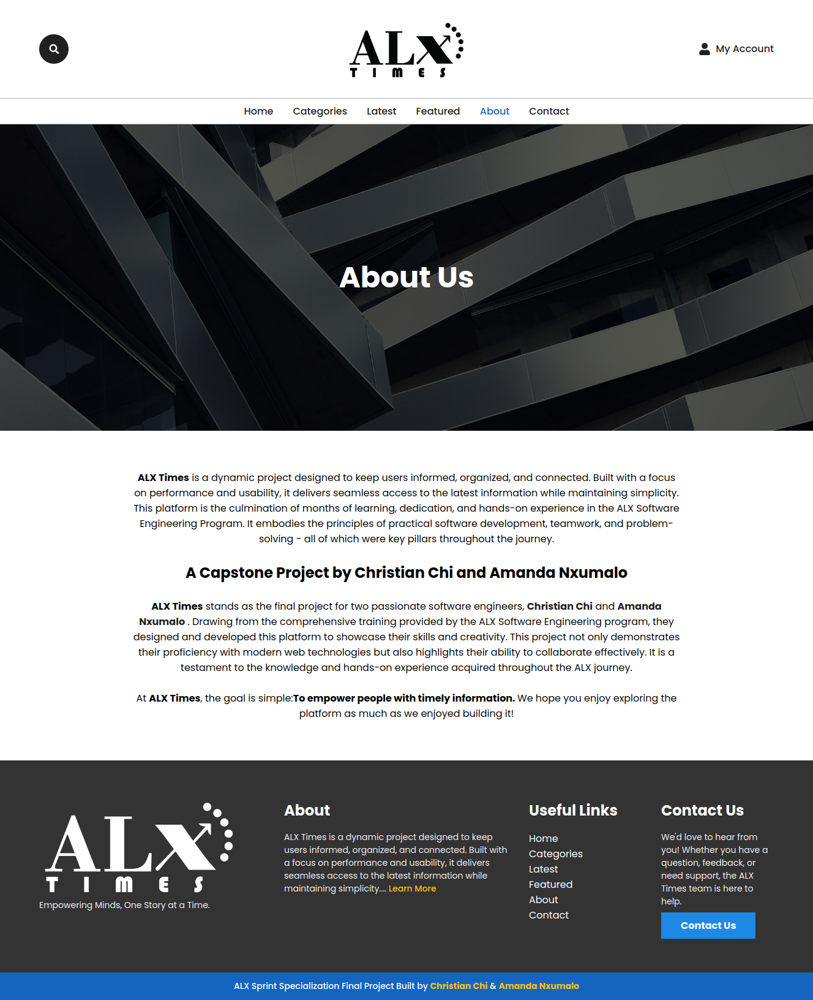
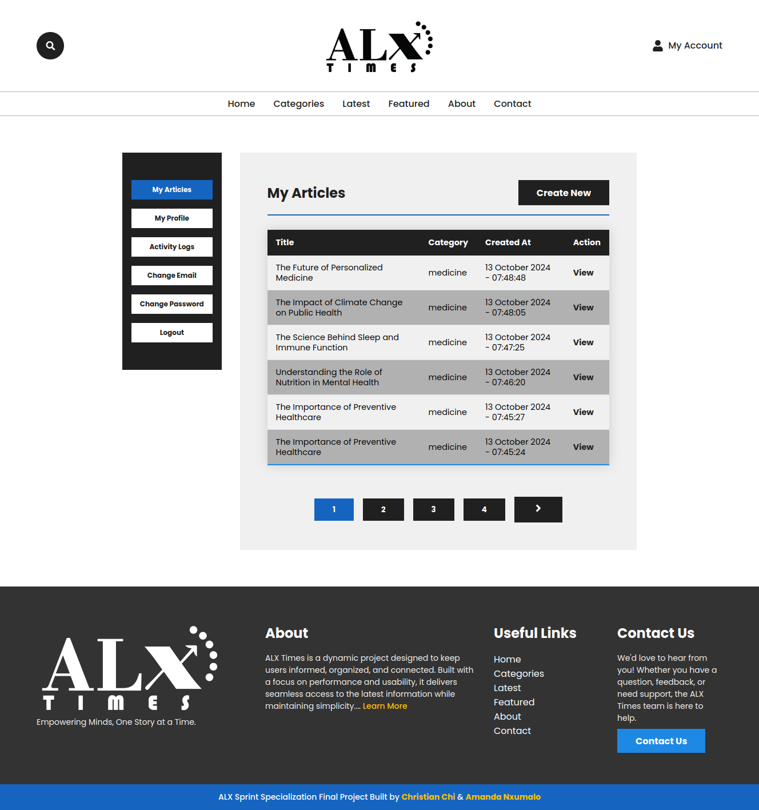
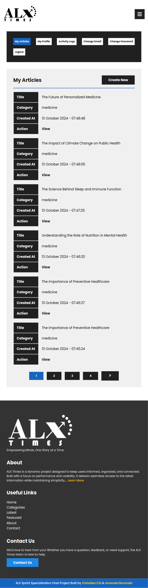
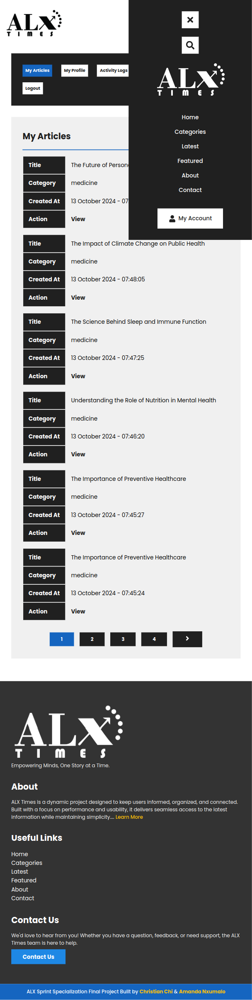
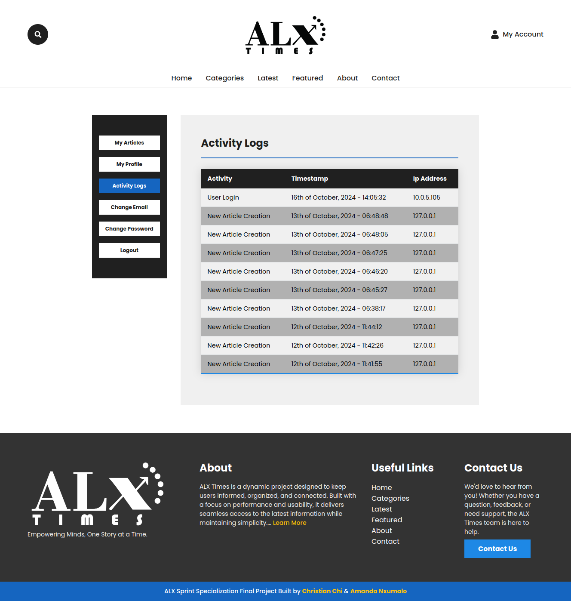
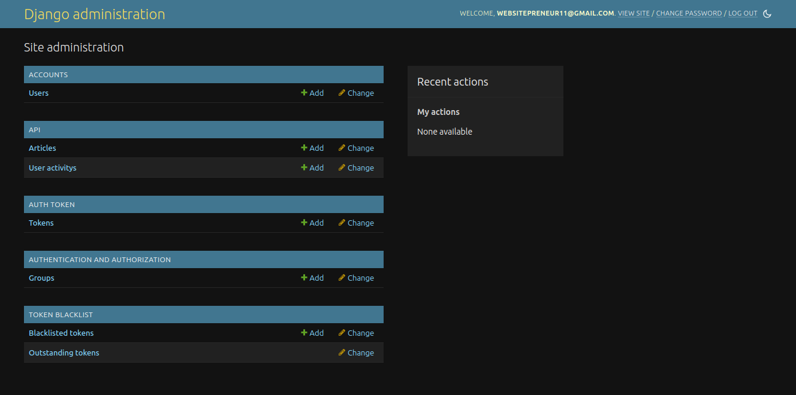

# ALX Times 📰

Welcome to the **ALX Times**, an article/news management system built as a final project for the **ALX Software Engineering** program. This platform emphasizes the importance of **accurate and timely information**, providing a seamless experience for both content creators and readers. 

## 🚀 Live Site  
Explore the live application: [ALX Times Live](https://alx-times.netlify.app)  

🎥 Watch the [Video Demo](https://youtu.be/y8Ua3E1lK-s)  

👨‍💻 Authors:  
- [Christian Chi](https://github.com/chrisHalogen)
- [Amanda Nxumalo](https://github.com/mooreArrqs)  

---

## 📖 Introduction  
The **ALX Times** was inspired by a passion for **making accurate and timely information available to all**. We believe that reliable news should be accessible, engaging, and fast. Our platform bridges the gap between traditional journalism and modern content management, offering users tools to create, manage, and explore articles efficiently.

---

## ✨ Features and Usage  

### User Account Management  
- Register a new account and log in.  
- Update profile information, change email, and reset passwords.  

### Article Management  
- Create, view, update, and delete articles.  
- Search and browse through existing articles.  

### Admin Capabilities  
- Mark articles as featured.  
- Permanently delete or restore deleted articles from the dashboard.  

### Track Activities  
- View user activity logs and monitor platform engagement.

---

## 📸 Screenshots  

| **Home**                        | **About ALX Times**               |
|---------------------------------|-----------------------------------|
|  |  |  

| **Categories**                  | **Contact Page**                 |
|---------------------------------|-----------------------------------|
|  |  |  

| **Latest Articles**             | **Mobile Home View**             |
|---------------------------------|-----------------------------------|
|  |  |  

| **Search Bar Open**             | **User Dashboard**               |
|---------------------------------|-----------------------------------|
|  |  |  

| **Dashboard Mobile View**       | **Mobile Menu Open**             |
|---------------------------------|-----------------------------------|
|  |  |  

| **Create New Article**          | **Activity Logs**                |
|---------------------------------|-----------------------------------|
|  |  |  

| **Admin Dashboard**             |                                   |
|---------------------------------|-----------------------------------|
|  |                                   |


---

## 🛠️ Contributing  
We welcome contributions from the community!  

1. **Fork the repository**  
2. **Create a new branch:**  
   ```bash
   git checkout -b feature-branch

